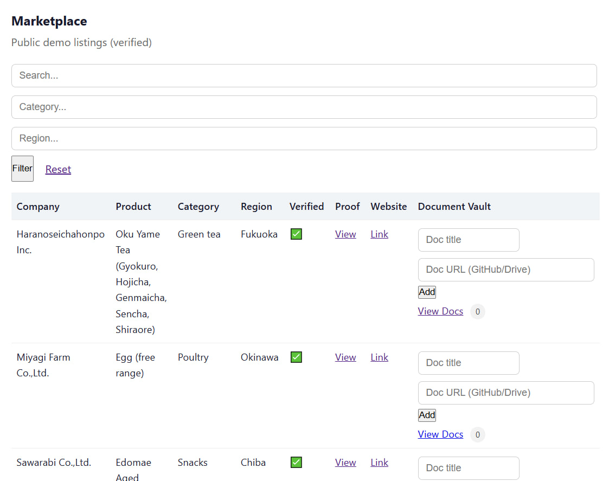
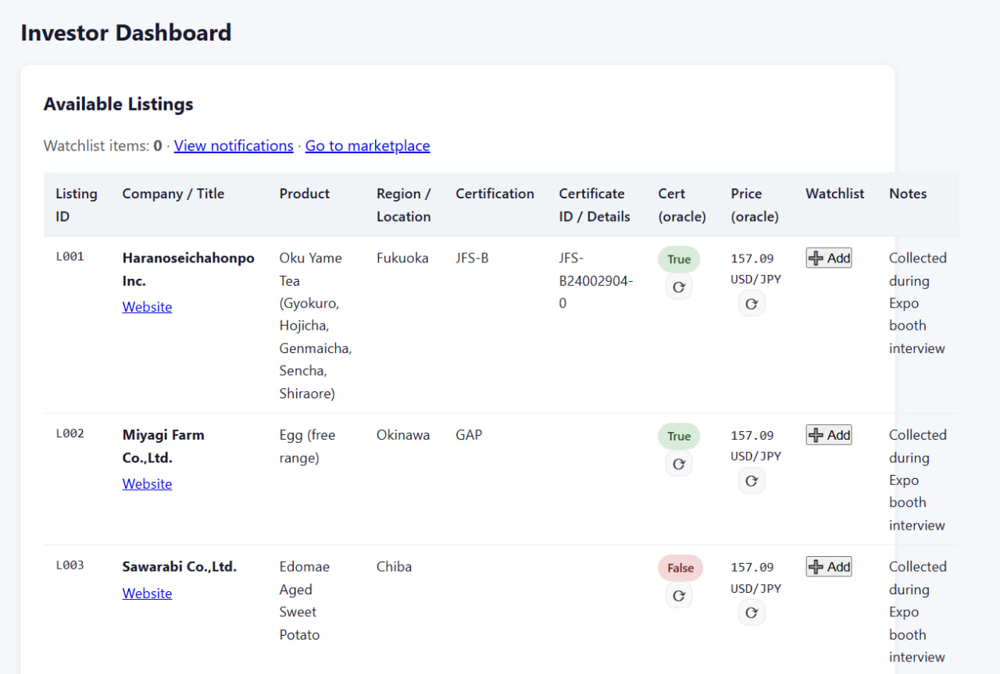
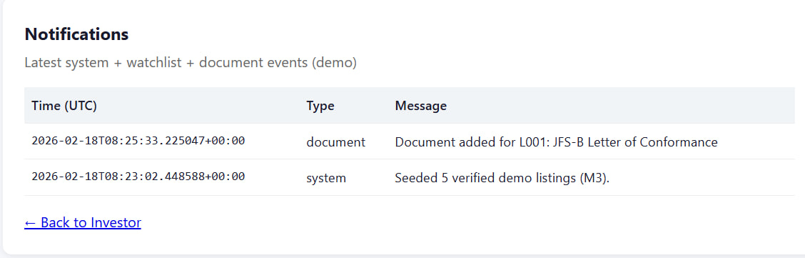
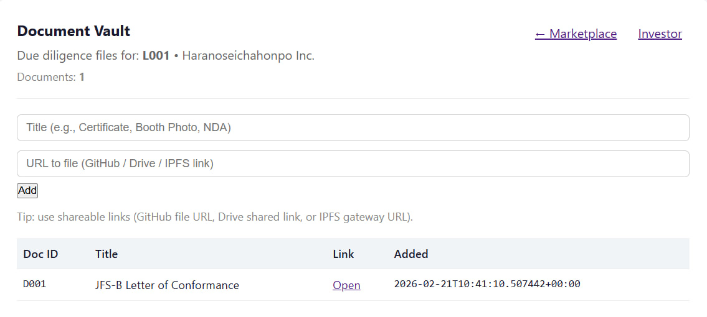

# HashiRWA — Milestone 3 Proof of Achievement
Marketplace MVP Launch

This milestone delivers a live demonstration environment for the HashiRWA marketplace platform. The deployment includes issuer and investor workflows, marketplace listings, verification indicators, and external reference data signals illustrating how real-world asset (RWA) listings can be presented in a tokenised marketplace.

The system is publicly accessible and operational.

---

# Live Platform

Landing Page  
https://app.hashirwa.trade/landing

Issuer Dashboard  
https://app.hashirwa.trade/issuer

Investor Dashboard  
https://app.hashirwa.trade/investor

Marketplace View  
https://app.hashirwa.trade/marketplace

---

# Milestone Objectives

Milestone 3 focuses on launching a working marketplace environment demonstrating the core components of the HashiRWA platform:

• Public marketplace listings  
• Issuer listing management interface  
• Investor browsing interface  
• Watchlist and notification system  
• Document vault for due diligence references  
• Oracle-enriched reference data signals

The platform is deployed as a live demonstration environment that allows users to navigate between issuer and investor workflows and review listings with verification indicators.

---

# Features Delivered

## Live Marketplace Interface
Public listings sourced from Japanese food and agricultural producers are displayed with product details, certification references, and supporting notes collected during field interviews.

## Issuer Dashboard
Issuers can review and manage listings, including certification identifiers and verification indicators associated with each listing.

## Investor Dashboard
Investors can browse available listings, review certification and reference data signals, and interact with listings through a watchlist mechanism.

## Watchlist & Notification System
The platform records watchlist activity and generates notification events reflecting marketplace interactions.

## Document Vault
Listings support a documentation vault where certification references and supporting documents can be attached for due diligence purposes.

## Oracle-Enriched Reference Signals
Listings display external reference indicators such as certification validation status and FX reference pricing signals demonstrating how oracle data can enrich marketplace information.

---

# Platform Screenshots

### Marketplace Interface

### Investor Dashboard

### Notification System

### Document Vault

---

# Quick Verification Steps

Reviewers can verify the milestone by following these steps:

1. Open the landing page  
   https://app.hashirwa.trade/landing

2. Navigate to the Marketplace page to view available listings.

3. Access the Investor dashboard to review listing details and watchlist functionality.

4. Observe notification events generated from platform interactions.

5. Review the repository documentation for additional technical context.

---

# Repository

Source code and milestone materials are available in the project repository:

https://github.com/Sapient-Predictive-Analytics/hashirwa

---

# Summary

The HashiRWA platform has been successfully deployed and is accessible as a live demonstration environment. The milestone confirms the successful launch of the marketplace MVP with issuer and investor workflows, listing verification signals, supporting documentation features, and oracle-enriched reference data.
